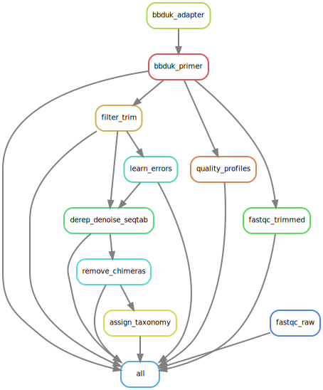

<a href="https://github.com/wegnerce/smk_16S_ampseq/releases/"></a>  <a href="#license"></a> <a href="https://python.org" title="Go to Python homepage"></a> <a href="https://zenodo.org/badge/latestdoi/660514400"></a> <a href="https://snakemake.github.io">
# smk_16S_ampseq - A Snakemake-based workflow for processing 16S rRNA gene amplicon sequencing data using DADA2
## :pushpin: Acknowledgement/Disclaimer
This workflow is based on the [DADA2 workflow for big data](https://benjjneb.github.io/dada2/bigdata.html), and heavily uses DADA2 [Snakemake wrappers](https://snakemake-wrappers.readthedocs.io/en/stable/wrappers/dada2.html). I debugged the workflow in a HPC environment using [SLURM](https://slurm.schedmd.com/overview.html) for job submission, and noticed problems with accessing the respective wrappers while the workflow is running. This might be related to an issue posted on [stackoverflow](https://stackoverflow.com/questions/76267968/snakemake-wrappers-not-working-on-slurm-cluster-compute-nodes-without-internet). As a consequence, I implemented the Snakemake wrappers as scripts into the workflow.

While writing this workflow, I found [this related one](https://github.com/SilasK/16S-dada2) written by [SilasK](https://github.com/SilasK) very useful.

## :exclamation: Needed/used software
The workflow is based on the following tools: 
- [`fastQC`](https://www.bioinformatics.babraham.ac.uk/projects/fastqc/)
- [`bbduk`](https://jgi.doe.gov/data-and-tools/software-tools/bbtools/)  part of the BBtools suite
- [`DADA2`](https://github.com/benjjneb/dada2)

Please cite the respective papers:

> * Andrews S. 2010. FastQC: a quality control tool for high throughput sequence data. http://www.bioinformatics.babraham.ac.uk/projects/fastqc.
>* Bushnell B. 2016. BBMap short read aligner. https://www.sourceforge.net/projects/bbmap/.
>* Callahan BJ, McMurdie PJ, Rosen MJ, Han AW, Johnson AJA, Holmes SP. 2016. [DADA2: High-resolution sample inference from Illumina amplicon data](http://dx.doi.org/10.1038/nmeth.3869). Nat Methods 13:581–583. 

The separate installation of the tools is not necessary, they are installed 'on the fly' (see _Usage_ below).

[`Snakemake`](https://snakemake.github.io/) should be installed as outlined in its [documentation](https://snakemake.readthedocs.io/en/stable/getting_started/installation.html) for instance using [`conda`](https://docs.conda.io/en/latest/miniconda.html)/[`mamba`](https://github.com/conda-forge/miniforge#mambaforge). It is recommended to create a dedicated `conda` environment for Snakemake.

## :blue_book: Description of the workflow
Paired-end sequencing data is first subjected to primer trimming and adapter removal using `bbduk`. Quality reports are written using `fastQC`before and after preprocessing.

In the following, data sets are treated according to the [big data DADA2 workflow](https://benjjneb.github.io/dada2/bigdata.html) using mostly [DADA2 Snakemake wrappers](https://snakemake-wrappers.readthedocs.io/en/stable/wrappers/dada2.html):

1. Determine quality profiles
2. Filter and trim
3. Learn errors
4. Dereplicate, denoise, make sequence/count table
5. Chimera removal
6. Taxonomic assignment

The final sequence/count table (chimera removal) (`results/06_DADA2_CHIMERACHECK/
seqTab.nochim.RDS`) and the taxonomic assignments (`ls 07_DADA2_TAX_ASSIGN/
taxa.RDS`) can be used for downstream processing/analysis, for instance using [`phyloseq`](https://joey711.github.io/phyloseq/index.html)

The below DAG graph outlines the different processes of the workflow.



## :hammer: Usage
Start by cloning the repository and move into respective directory.
```
git clone https://github.com/wegnerce/smk_16S_ampseq.git
cd smk_16S_ampseq
```
Place paired sequence data in `data/`. The workflow expects the following sample nomenclature:
»» `NameOfSample_R{1,2}.fastq.gz`

The repository contains one exemplary pair of files (K6_rep1_R1.fastq.gz + K6_rep1_R2.fastq.gz).

`config/` contains, besides from the configuration of the workflow (`config/config.yaml`), a tab-separated table `samples.tsv`, which contains a list of all datasets, one per line. 

`config/config.yaml` should be modified dependent on the used primer set for amplicon sequencing. By default, the widely used primer set [341F/785R (Klindworth et al., 2013)](https://academic.oup.com/nar/article/41/1/e1/1164457?login=false) is pre-defined in the `bbduk`settings for primer removal.

The `DADA2` wrappers/scripts can be modified as needed, based on information in the [big data DADA2 workflow](https://benjjneb.github.io/dada2/bigdata.html) and the documentation of the [DADA2 Snakemake wrappers](https://snakemake-wrappers.readthedocs.io/en/stable/wrappers/dada2.html).

Taxonomic assignments are done using [SILVA](https://www.arb-silva.de/) reference databases, maintained by the [`DADA2`developers](https://benjjneb.github.io/dada2/training.html).

```
# move into the resources directory
cd resources
# download a pre-formatted SILVA reference DB
wget https://zenodo.org/records/4587955/files/silva_nr99_v138.1_train_set.fa.gz
cd ..
```

From the root directory of the workflow, processing the data can then be started.
```
# --use-conda makes sure that needed tools are installed based
# on the requirements specified in the respective *.yaml in /envs
snakemake  --use-conda
```
The directory structure of the workflow is shown below:
```bash
├── LICENSE
├── config
│   ├── config.yaml
│   └── samples.tsv
├── data
│   ├── K6_rep1_R1.fastq.gz
│   └── K6_rep1_R2.fastq.gz
├── logs
├── resources
│   ├── adapters.fa
│   └── silva_nr99_v138.1_train_set.fa.gz
├── results
│   ├── 01_TRIMMED
│   ├── 02_DADA2_QUAL_PROFILES
│   ├── 03_DADA2_TRIMMED
│   ├── 04_DADA2_ERROR_MODELS
│   ├── 04_DADA2_UNIQ
│   ├── 05_DADA2_SEQTAB
│   ├── 06_DADA2_CHIMERACHECK
│   └── 07_DADA2_TAX_ASSIGN
└── workflow
    ├── Snakefile
    ├── envs
    ├── rules
    └── scripts
```
Output from the different steps of the workflow are stored in `/results` and `/logs`. 

:copyright: Carl-Eric Wegner, 2023
